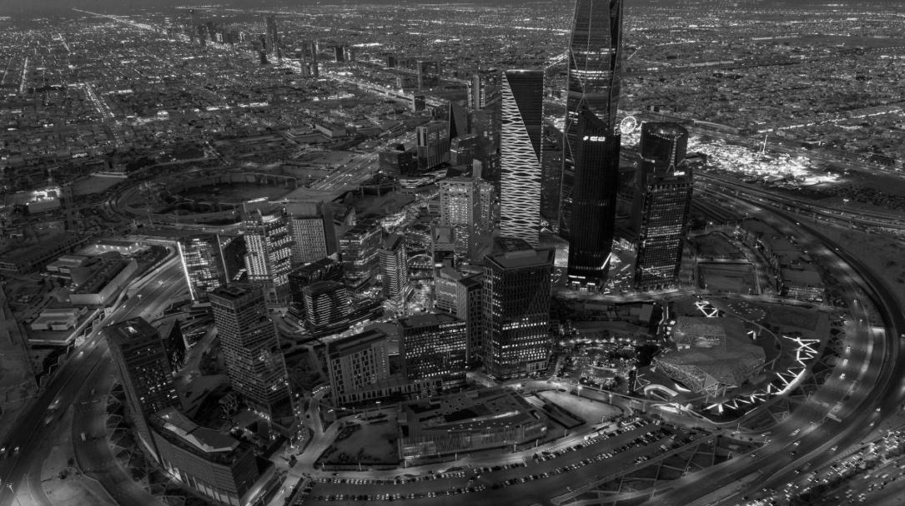
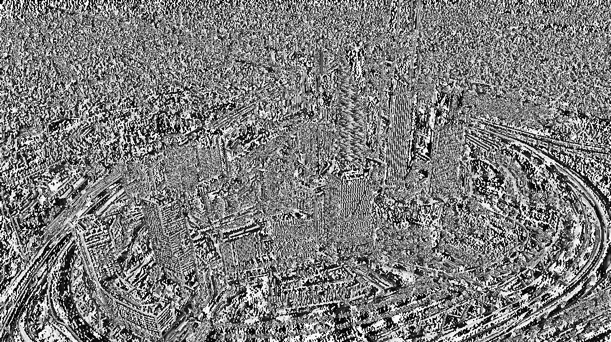
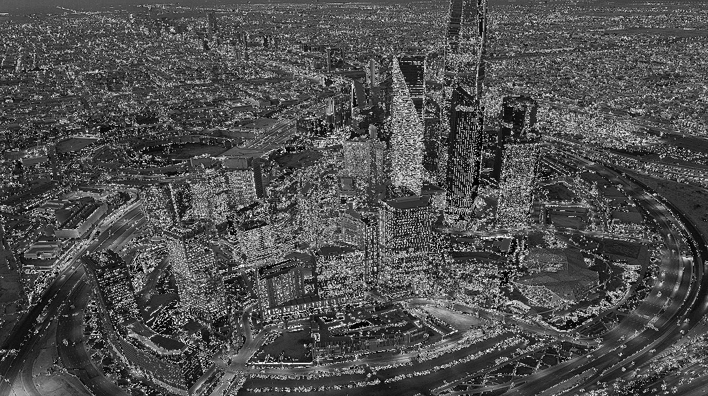

# Image Processing - Filtering Techniques 🚀

## 📌 Project Overview
This project demonstrates various **image filtering techniques** using Python, OpenCV, and NumPy. The main goal is to apply different filters to modify images, including:

- ✅ **Smoothing (Box Filter)** – Reduces noise and smooths the image.
- ✅ **Edge Detection (Sobel Filter)** – Highlights strong transitions in pixel intensity.
- ✅ **Sharpening Filter** – Enhances image details and contrast.

## 🔹 Technologies Used
- Python 🐍
- OpenCV 📷
- NumPy 🔢
- Matplotlib 📊

## 📸 Sample Results
Here are examples of the filtered images:

| Original | Smoothed | Edge Detection (Sobel X) | Sharpened |
|----------|----------|-------------------------|-----------|
|  |  |  |  |

## 🛠 How to Run the Code
1. Install the required libraries:
   ```bash
   pip install opencv-python numpy matplotlib
   
Open Image_Processing_Filtering.ipynb in Jupyter Notebook or Google Collab.
Run the notebook to process and visualize filtered images.

🔗 Connect with Me
If you have any feedback or suggestions, feel free to connect with me on [LinkedIn]([linkedin.com/in/abdulrhman-almania-3844602b4](https://www.linkedin.com/in/abdulrhman-almania-3844602b4?utm_source=share&utm_campaign=share_via&utm_content=profile&utm_medium=ios_app)) 

